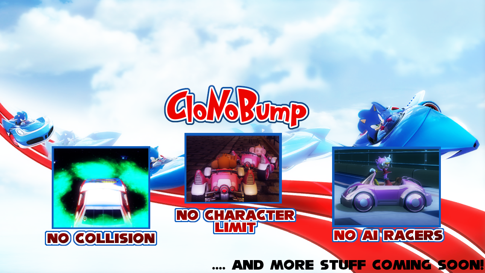

## Supercharge your Sonic & All-Stars Racing Transformed!

## CloNoBump Supercharged can do much more!
 * Change the number of seconds before getting DNF in a race
 * Make all players start the race in the same position
 * Make all vehicles (except your own) invisible for a few seconds after race start
 * Allow local custom games without needing extra players (boost/battle single races!)
 * Change the speed/boost/acceleration/handling stats for each character
 * Works in offline mode and custom games
 * Fully configurable by editing `settings.xml`. Changes are applied automatically the moment you save the file.
 * Lobby host has easy control of the settings. `settings.xml` is distributed automatically to lobby members.

## How to install
 1. Download `CloNoBump_Supercharged.zip` from the [latest release](https://github.com/Tyaap/ASRT_CloNoBump_Supercharged/releases)
 2. Open the zip file and extract the CloNoBump Supercharged folder (does not matter where)
 3. Start Sonic & All-Stars Racing Transformed
 4. Run `CloNoBump Supercharged.exe`
 5. A message should appear saying CloNoBump Supercharged is enabled
 6. Please carefully read the additional information in the message

## How to uninstall
 * Run `CloNoBump Supercharged.exe` again, and choose to disable CloNoBump Supercharged
 * Alternatively, close and re-open Sonic & All-Stars Racing Transformed
 
### I hope you enjoy the mod! :)
